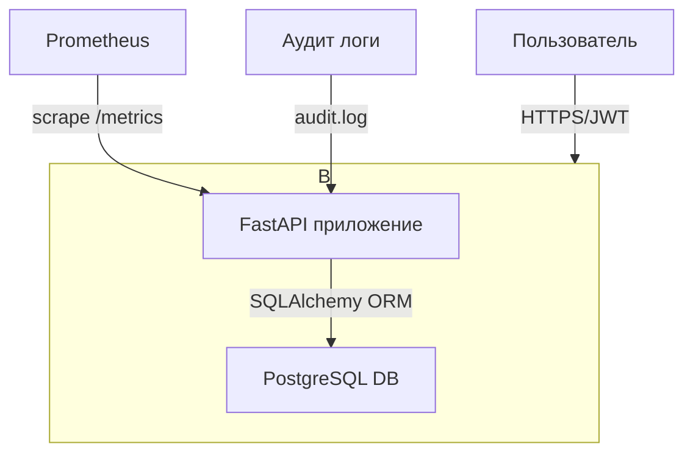

# Детальный отчет по безопасности: Habit Tracker API
# Лопаткин Пётр Сергеевич БПИ234

Этот отчет основан на анализе исходного кода проекта `course-project-lopata29435`.

## 1. Нефункциональные требования безопасности (NFR)

| Требование | Статус | Подтверждение в коде | KPI / Метрики |
| :--- | :--- | :--- | :--- |
| **1. Валидация ввода** | **Реализовано** | `app/models.py`: Pydantic модели `HabitCreate`, `TrackingCreate` с валидаторами. | 100% эндпоинтов используют Pydantic; 0 инцидентов, связанных с невалидными данными. |
| **2. Защита от XSS** | **Реализовано** | `app/models.py`: Валидаторы в `HabitCreate` запрещают символы `<`, `>`, `&`. | SAST-сканер не находит XSS-уязвимостей; 100% полей с пользовательским вводом проходят очистку. |
| **3. Rate Limiting (DoS)** | **Реализовано** | `app/security.py`: `RateLimitMiddleware` активен в `main.py`. | Запросы от одного IP ограничены `100/min`; 0 DoS-инцидентов из-за флуда. |
| **4. Безопасные заголовки** | **Реализовано** | `app/security.py`: `SecurityHeadersMiddleware` активен в `main.py`. | 100% ответов содержат `X-Content-Type-Options`, `CSP`, `X-Frame-Options`. |
| **5. Структурированные ошибки** | **Реализовано** | `app/errors.py`: Обработчики ошибок в формате RFC 7807, `correlation_id`. | 100% ошибок `4xx/5xx` соответствуют формату RFC 7807; нет утечек стектрейсов. |
| **6. Запуск от non-root** | **Реализовано** | `Dockerfile`: `USER appuser`. | 100% контейнеров в `prod` запущены от пользователя без root-прав. |
| **7. Аутентификация (AuthN)** | **Реализовано** | `app/auth.py`: JWT-аутентификация, `app/config.py`: `AUTH_ENABLED = True`. | 100% защищенных endpoints требуют валидный JWT токен. |
| **8. Авторизация (AuthZ)** | **Реализовано** | Проверка прав доступа к привычкам по `owner_id` во всех endpoints. | Каждый пользователь видит только свои привычки. |
| **9. Хранение паролей** | **Реализовано** | `app/auth.py`: Argon2 хеширование через `passlib`. | Пароли хешируются с использованием современного алгоритма Argon2. |
| **10. Аудит логирование** | **Реализовано** | `app/audit.py`: Логирование всех CREATE/UPDATE/DELETE операций. | Все критичные операции логируются с user_id и correlation_id. |
| **11. Персистентное хранилище** | **Реализовано** | `app/config.py`: `USE_PERSISTENT_DB = True`, PostgreSQL через SQLAlchemy. | Данные сохраняются в PostgreSQL, переживают перезапуск. |
| **12. Метрики и мониторинг** | **Реализовано** | `app/metrics.py`: Prometheus метрики, endpoint `/metrics`. | Отслеживание HTTP запросов, ошибок, бизнес-метрик в формате Prometheus. |

## 2. Моделирование архитектуры и потоков данных

**Архитектура**: Приложение представляет собой монолитный сервис на `FastAPI`, запускаемый в `Docker`-контейнере. Использует PostgreSQL в качестве персистентного хранилища.

**DFD (уровень контекста):**



**Границы доверия**:
1.  **Пользователь -> Контейнер**: Основная граница. Весь входящий трафик аутентифицируется через JWT токены.
2.  **Приложение -> База данных**: Защищено через SQLAlchemy ORM (предотвращает SQL injection).
3.  **Внутри контейнера**: Приложение запускается от непривилегированного пользователя `appuser`.

## 3. STRIDE-анализ

| Категория | Угроза | Компонент/Поток | Статус |
| :--- | :--- | :--- | :--- |
| **S**poofing | Нет аутентификации, любой пользователь может выдавать себя за другого. | `Все эндпоинты` | **Смягчено** - JWT аутентификация реализована |
| **T**ampering | Изменение данных другого пользователя (т.к. нет авторизации). | `PUT /habits/{habit_id}` | **Смягчено** - Проверка owner_id |
| **R**epudiation | Отсутствие логов аудита для критичных операций. | `POST`, `PUT` запросы | **Смягчено** - Аудит логирование реализовано |
| **I**nfo Disclosure | Утечка данных всех пользователей через эндпоинт `GET /habits`. | `GET /habits` | **Смягчено** - Фильтрация по owner_id |
| **I**nfo Disclosure | Раскрытие версии Python и фреймворка в стектрейсах. | `app/errors.py` | **Смягчено** |
| **D**enial of Service | Флуд запросами на создание привычек, исчерпание памяти. | `POST /habits` | **Смягчено** - Rate limiting + квоты |
| **E**levation of Privilege | Неприменимо, так как в системе нет ролей и привилегий. | N/A | **Низкий риск** |

## 4. Меры защиты и трассировка

### Контроль: JWT Аутентификация и Авторизация

Защищает от Spoofing, Tampering и Info Disclosure.

*   **Угрозы**: Несанкционированный доступ к данным, выдача себя за другого пользователя, изменение чужих данных.
*   **Контроль**: JWT токены с Argon2 хешированием паролей, проверка владельца ресурса.
*   **Пример кода (`app/auth.py`)**:
    ```python
    async def get_current_user(
        token: str = Depends(oauth2_scheme),
        db: Session = Depends(get_db)
    ) -> User:
        """Получение текущего пользователя из JWT токена"""
        try:
            payload = jwt.decode(token, SECRET_KEY, algorithms=[AUTH_JWT_ALGORITHM])
            username: str = payload.get("sub")
            if username is None:
                raise credentials_exception
        except JWTError:
            raise credentials_exception

        user = get_user_by_username(db, username=username)
        if user is None or not user.is_active:
            raise credentials_exception

        return user
    ```
*   **Критерий приемки**: Все защищенные endpoints требуют валидный JWT токен. Пользователь может видеть/изменять только свои привычки.

### Контроль: Аудит логирование

Предотвращает Repudiation (отказ от действий).

*   **Угроза**: Невозможность отследить, кто и когда выполнил критичные операции.
*   **Контроль**: Централизованное логирование всех CREATE/UPDATE/DELETE операций.
*   **Пример кода (`app/audit.py`)**:
    ```python
    def log_audit_event(
        action: str,
        resource_type: str,
        resource_id: Optional[int],
        user_id: Optional[int],
        correlation_id: str,
        details: Optional[dict] = None,
        status: str = "success"
    ) -> None:
        """Логирование аудит-события"""
        audit_data = {
            "action": action,
            "resource_type": resource_type,
            "resource_id": resource_id,
            "user_id": user_id,
            "correlation_id": correlation_id,
            "status": status,
            "timestamp": datetime.utcnow().isoformat(),
        }
        audit_logger.info(json.dumps(audit_data))
    ```
*   **Критерий приемки**: Все CREATE/UPDATE/DELETE операции логируются в `audit.log` с user_id, correlation_id и временной меткой.

### Контроль: Prometheus метрики

Обеспечивает наблюдаемость и раннее обнаружение атак.

*   **Угроза**: DoS атаки, аномальная активность остается незамеченной.
*   **Контроль**: Экспорт метрик HTTP запросов, ошибок, бизнес-операций.
*   **Пример кода (`app/metrics.py`)**:
    ```python
    http_requests_total = Counter(
        'http_requests_total',
        'Total number of HTTP requests',
        ['method', 'endpoint', 'status_code']
    )

    http_request_duration_seconds = Histogram(
        'http_request_duration_seconds',
        'HTTP request duration in seconds',
        ['method', 'endpoint']
    )
    ```
*   **Критерий приемки**: Endpoint `/metrics` возвращает метрики в формате Prometheus. Отслеживаются все HTTP запросы, ошибки, и бизнес-операции.

### Контроль: Валидация входных данных (Pydantic)

Эта мера защищает от множества атак, включая XSS и инъекции данных.

*   **Угроза (Tampering, Info Disclosure)**: Внедрение вредоносных скриптов (`<script>`) в поля `name` или `description`.
*   **Контроль**: Использование моделей `Pydantic` с кастомными валидаторами.
*   **Пример кода (`app/models.py`)**:
    ```python
    class HabitCreate(BaseModel):
        name: str = Field(
            ...,
            min_length=1,
            max_length=100,
            description="Название привычки (1-100 символов)",
        )
        # ...

        @field_validator("name")
        @classmethod
        def validate_name_content(cls, v: str) -> str:
            """Проверка содержимого имени (запрет опасных символов)"""
            dangerous_chars = ["<", ">", "&", '"', "'", "`"]
            for char in dangerous_chars:
                if char in v:
                    raise ValueError(f"Название содержит недопустимый символ: {char}")
            return v.strip()
    ```
*   **Критерий приемки (AC)**: Все `POST`/`PUT` эндпоинты принимают данные через Pydantic-модели. Негативные тесты в `tests/test_validation.py` проверяют некорректный ввод.

### Контроль: Запуск от Non-Root пользователя

Снижает ущерб в случае компрометации контейнера (RCE).

*   **Угроза (Elevation of Privilege)**: Если злоумышленник получит RCE в контейнере, он не будет иметь `root`-прав в системе.
*   **Контроль**: Использование `USER` инструкции в `Dockerfile`.
*   **Пример кода (`Dockerfile`)**:
    ```dockerfile
    # Runtime stage
    FROM python:3.11-slim
    WORKDIR /app
    RUN useradd -m appuser
    # ... (копирование файлов)
    USER appuser
    CMD ["uvicorn", "app.main:app", "--host", "0.0.0.0", "--port", "8000"]
    ```
*   **AC**: Проверка запущенного контейнера командой `docker top <container_id>` показывает, что процесс запущен от `appuser`.

## 5. Приоритизация рисков

| Риск | Угроза | Приоритет | План внедрения |
| :--- | :--- | :--- | :--- |
| **1. Отсутствие аутентификации и авторизации** | Spoofing, Tampering, Info Disclosure | ~~**Критичный**~~ | **✅ Реализовано**: JWT-аутентификация, привязка привычек к user_id. |
| **2. DoS-атака на создание ресурсов** | Denial of Service | ~~**Высокий**~~ | **✅ Реализовано**: `RateLimitMiddleware` активирован, квоты ресурсов. |
| **3. Отсутствие персистентного хранилища** | Info Disclosure (при перезапуске все теряется), Repudiation | ~~**Средний**~~ | **✅ Реализовано**: PostgreSQL с SQLAlchemy. |
| **4. Отсутствие аудит логирования** | Repudiation, Compliance | ~~**Средний**~~ | **✅ Реализовано**: Логирование всех критичных операций в `audit.log`. |
| **5. Отсутствие мониторинга** | Detection, Response | ~~**Средний**~~ | **✅ Реализовано**: Prometheus метрики через `/metrics`. |

## 6. DevSecOps-процесс

*   **Ветвление Git**: Стандартная модель `feature` -> `main`. PR требуют ревью.
*   **Docker**: Используется `multi-stage build`. Сначала устанавливаются зависимости и запускаются тесты, затем в "чистый" образ копируется только код и зависимости.
    *   **Пример из `Dockerfile`**:
        ```dockerfile
        # Build stage
        FROM python:3.11-slim AS build
        WORKDIR /app
        COPY requirements.txt requirements-dev.txt ./
        RUN pip install --no-cache-dir -r requirements.txt -r requirements-dev.txt
        COPY . .
        RUN pytest -q

        # Runtime stage
        FROM python:3.11-slim
        WORKDIR /app
        RUN useradd -m appuser
        COPY --from=build /usr/local/lib/python3.11 /usr/local/lib/python3.11
        # ...
        ```
*   **CI/CD**: `Dockerfile` содержит шаг `RUN pytest -q`, что подразумевает запуск тестов при каждой сборке. Это базовый CI-шаг.
*   **Сканирование**:

## 7. Secure Coding

*   **Валидация входных данных**: **Выполнено** через `Pydantic` (`app/models.py`).
*   **Защита от SQLi**: **Выполнено**, используется SQLAlchemy ORM с параметризованными запросами, исключающими SQL injection.
*   **Обработка ошибок**: **Выполнено**. Ошибки обрабатываются централизованно в `app/errors.py`, предотвращая утечку стектрейсов.
    *   **Пример из `app/main.py`**:
        ```python
        app.add_exception_handler(ApiError, api_error_handler)
        app.add_exception_handler(Exception, generic_exception_handler)
        ```
*   **Тестирование**: **Выполнено**. Проект содержит обширный набор тестов, включая негативные сценарии (`tests/test_validation.py`).
*   **Хеширование паролей**: **Выполнено**. Используется Argon2 - современный и безопасный алгоритм хеширования через `passlib`.

## 8. Наблюдаемость и реагирование

*   **Логи**: **Реализовано**.
    *   Аудит логирование в `audit.log` с JSON форматом для всех критичных операций (CREATE/UPDATE/DELETE)
    *   Каждая операция включает `user_id`, `correlation_id`, `timestamp`, `action`, `resource_type`
    *   `correlation_id` в ошибках для трассировки запросов
    *   **Пример из `app/audit.py`**:
        ```python
        audit_data = {
            "action": action,
            "resource_type": resource_type,
            "user_id": user_id,
            "correlation_id": correlation_id,
            "timestamp": datetime.utcnow().isoformat(),
        }
        audit_logger.info(json.dumps(audit_data))
        ```
*   **Метрики**: **Реализовано**.
    *   Prometheus метрики доступны на `/metrics` endpoint
    *   Отслеживание HTTP запросов, времени ответа, ошибок
    *   Бизнес-метрики: регистрации пользователей, создание привычек, отслеживание выполнений
    *   Метрики аутентификации: успешные/неудачные попытки входа
    *   **Пример из `app/metrics.py`**:
        ```python
        http_requests_total = Counter('http_requests_total',
            'Total number of HTTP requests',
            ['method', 'endpoint', 'status_code'])

        http_request_duration_seconds = Histogram('http_request_duration_seconds',
            'HTTP request duration in seconds',
            ['method', 'endpoint'])
        ```
*   **Health Check**: **Выполнено**. Эндпоинт `/health` и `HEALTHCHECK` в `Dockerfile` позволяют системе оркестрации (например, Docker Swarm, Kubernetes) отслеживать состояние приложения.
    *   **Пример из `Dockerfile`**:
        ```dockerfile
        HEALTHCHECK CMD curl -f http://localhost:8000/health || exit 1
        ```

## 9. Итоговая оценка безопасности

### ✅ Реализованные контроли безопасности:

1. **Аутентификация и авторизация** - JWT токены с Argon2 хешированием
2. **Валидация входных данных** - Pydantic модели с кастомными валидаторами
3. **Rate Limiting** - Защита от DoS атак (100 req/min)
4. **Безопасные заголовки** - X-Frame-Options, CSP, X-Content-Type-Options
5. **Аудит логирование** - Все критичные операции логируются
6. **Персистентное хранилище** - PostgreSQL с SQLAlchemy ORM
7. **Защита от SQL Injection** - Параметризованные запросы через ORM
8. **Мониторинг и метрики** - Prometheus метрики
9. **Запуск от non-root** - Контейнер запускается от `appuser`
10. **CI/CD Security Scanning** - SAST, SCA, DAST, Secret Scanning
