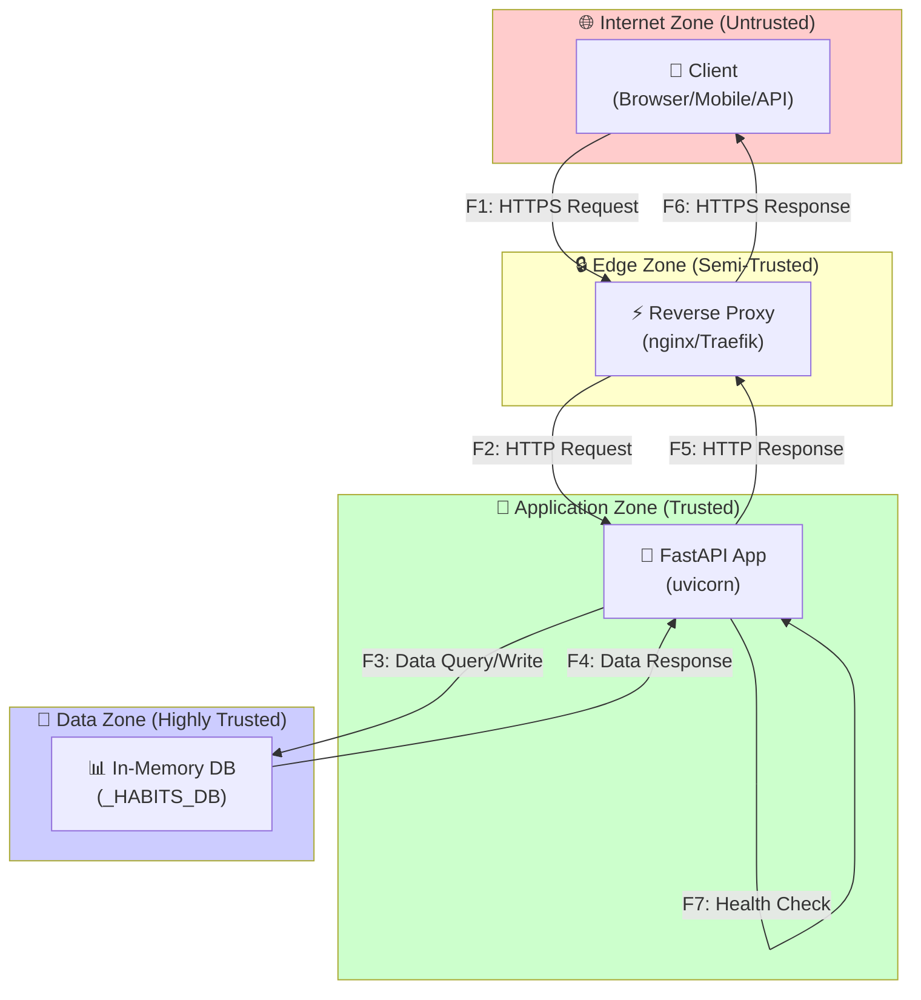
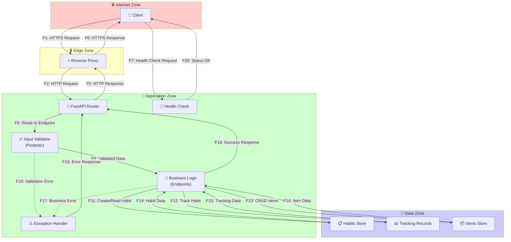
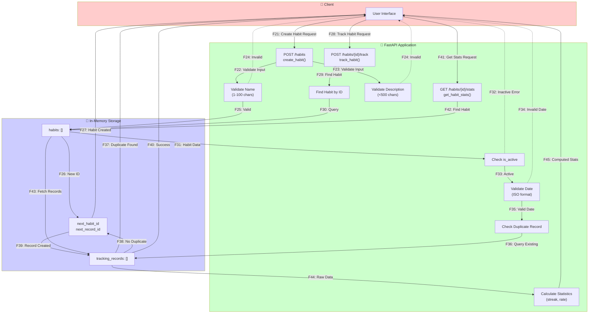

# Data Flow Diagram (DFD) — Habit Tracker API

## Введение

Данный документ содержит диаграмму потоков данных (DFD) для Habit Tracker API с отмеченными границами доверия и нумерованными потоками данных. Эти идентификаторы потоков (F1...Fn) используются в анализе STRIDE и реестре рисков.

**Дата:** 2025-10-10
**Версия:** 1.0
**Проект:** Habit Tracker API

---

## Границы доверия

1. **Internet Zone** — Интернет, клиенты (браузеры, мобильные приложения, API-клиенты)
2. **Edge Zone** — Reverse Proxy / Load Balancer (в продакшене)
3. **Application Zone** — FastAPI приложение (контейнер)
4. **Data Zone** — In-Memory хранилище данных (_HABITS_DB, _DB)

---

## DFD Level 0 — Контекст системы



---

## DFD Level 1 — Детальная архитектура приложения



---

## DFD Level 2 — Критический процесс (Создание и отслеживание привычки)



---

## Описание потоков данных

| ID   | Поток | Источник | Назначение | Протокол/Формат | Граница доверия | Описание |
|------|-------|----------|------------|-----------------|-----------------|----------|
| F1   | HTTPS Request | Client | Reverse Proxy | HTTPS/TLS 1.2+ | Internet → Edge | Клиентский запрос через интернет |
| F2   | HTTP Request | Reverse Proxy | FastAPI Router | HTTP/JSON | Edge → Application | Проксированный запрос в приложение |
| F3   | Data Query/Write | FastAPI App | In-Memory DB | Python Dict | Application → Data | Операции с данными (CRUD) |
| F4   | Data Response | In-Memory DB | FastAPI App | Python Dict | Data → Application | Результат запроса данных |
| F5   | HTTP Response | FastAPI App | Reverse Proxy | HTTP/JSON | Application → Edge | Ответ приложения |
| F6   | HTTPS Response | Reverse Proxy | Client | HTTPS/JSON | Edge → Internet | Зашифрованный ответ клиенту |
| F7   | Health Check | Client/Monitor | Health Endpoint | HTTP/GET | Internet → Application | Проверка доступности |
| F8   | Route to Endpoint | Router | Validator | Python Object | Internal | Маршрутизация запроса |
| F9   | Validated Data | Validator | Business Logic | Python Object | Internal | Валидированные данные |
| F10  | Validation Error | Validator | Error Handler | Exception | Internal | Ошибка валидации |
| F11  | Create/Read Habit | Business Logic | Habits Store | Python Dict | Application → Data | CRUD операции с привычками |
| F12  | Track Habit | Business Logic | Tracking Records | Python Dict | Application → Data | Запись отслеживания |
| F13  | CRUD Items | Business Logic | Items Store | Python Dict | Application → Data | Операции с items (demo) |
| F14  | Habit Data | Habits Store | Business Logic | Python Dict | Data → Application | Данные привычек |
| F15  | Tracking Data | Tracking Records | Business Logic | Python Dict | Data → Application | Данные отслеживания |
| F16  | Item Data | Items Store | Business Logic | Python Dict | Data → Application | Данные items |
| F17  | Business Error | Business Logic | Error Handler | Exception | Internal | Бизнес-логика ошибка |
| F18  | Success Response | Business Logic | Router | Python Dict | Internal | Успешный результат |
| F19  | Error Response | Error Handler | Router | JSON Error | Internal | Форматированная ошибка |
| F20  | Status OK | Health Check | Client | JSON | Application → Internet | Статус здоровья |
| F21  | Create Habit Request | User | create_habit() | JSON/POST | Client → API | Создание привычки |
| F22  | Validate Input | create_habit() | ValidateName | String | Internal | Проверка имени |
| F23  | Validate Input | create_habit() | ValidateDesc | String | Internal | Проверка описания |
| F24  | Invalid | Validator | User | JSON Error | API → Client | Ошибка валидации |
| F25  | Valid | Validator | Habits List | Python Dict | Internal | Валидные данные |
| F26  | New ID | Habits List | ID Counters | Integer | Internal | Генерация ID |
| F27  | Habit Created | Storage | User | JSON | Data → Client | Созданная привычка |
| F28  | Track Habit Request | User | track_habit() | JSON/POST | Client → API | Отметка выполнения |
| F29  | Find Habit | track_habit() | FindHabit | Integer ID | Internal | Поиск привычки |
| F30  | Query | FindHabit | Habits List | Integer | Internal | Запрос данных |
| F31  | Habit Data | Habits List | CheckActive | Python Dict | Internal | Данные привычки |
| F32  | Inactive Error | CheckActive | User | JSON Error | API → Client | Привычка неактивна |
| F33  | Active | CheckActive | ValidateDate | Python Dict | Internal | Активная привычка |
| F34  | Invalid Date | ValidateDate | User | JSON Error | API → Client | Некорректная дата |
| F35  | Valid Date | ValidateDate | CheckDuplicate | Date Object | Internal | Валидная дата |
| F36  | Query Existing | CheckDuplicate | Tracking List | Query | Internal | Проверка дубликата |
| F37  | Duplicate Found | Tracking List | User | JSON | Data → Client | Уже отмечено |
| F38  | No Duplicate | Tracking List | ID Counters | Success | Internal | Дубликат не найден |
| F39  | Record Created | ID Counters | Tracking List | Python Dict | Internal | Создана запись |
| F40  | Success | Tracking List | User | JSON | Data → Client | Успешное отслеживание |
| F41  | Get Stats Request | User | get_habit_stats() | JSON/GET | Client → API | Запрос статистики |
| F42  | Find Habit | get_habit_stats() | Habits List | Integer ID | Internal | Поиск привычки |
| F43  | Fetch Records | Habits List | Tracking List | Query | Internal | Получение записей |
| F44  | Raw Data | Tracking List | CalculateStats | List[Dict] | Internal | Сырые данные |
| F45  | Computed Stats | CalculateStats | User | JSON | Data → Client | Вычисленная статистика |

---

## Альтернативный сценарий: Деактивация привычки

```mermaid
graph TB
    subgraph Client["👤 Client"]
        User["User Interface"]
    end

    subgraph API["🚀 FastAPI Application"]
        UpdateHabit["PUT /habits/{id}<br/>update_habit()"]
        FindHabit["Find Habit by ID"]
        ValidateFields["Validate Update Fields"]
        ApplyUpdate["Apply Updates"]
    end

    subgraph Storage["💾 Storage"]
        HabitsList["habits: []"]
    end

    User -->|F46: Update Request<br/>{is_active: false}| UpdateHabit
    UpdateHabit -->|F47: Find Habit| FindHabit
    FindHabit -->|F48: Query| HabitsList

    HabitsList -->|F49: Habit Data| ValidateFields
    ValidateFields -.->|F50: Not Found Error| User
    ValidateFields -->|F51: Valid Update| ApplyUpdate

    ApplyUpdate -->|F52: Update Fields| HabitsList
    HabitsList -->|F53: Updated Habit| User

    style Client fill:#ffcccc
    style API fill:#ccffcc
    style Storage fill:#ccccff
```

### Дополнительные потоки (альтернативный сценарий)

| ID   | Поток | Источник | Назначение | Протокол/Формат | Описание |
|------|-------|----------|------------|-----------------|----------|
| F46  | Update Request | User | update_habit() | JSON/PUT | Запрос обновления (деактивация) |
| F47  | Find Habit | update_habit() | FindHabit | Integer ID | Поиск привычки для обновления |
| F48  | Query | FindHabit | Habits List | Integer | Запрос данных привычки |
| F49  | Habit Data | Habits List | ValidateFields | Python Dict | Текущие данные привычки |
| F50  | Not Found Error | ValidateFields | User | JSON Error | Привычка не найдена |
| F51  | Valid Update | ValidateFields | ApplyUpdate | Python Dict | Валидные обновления |
| F52  | Update Fields | ApplyUpdate | Habits List | Python Dict | Применение изменений |
| F53  | Updated Habit | Habits List | User | JSON | Обновленная привычка |

---

## Внешние участники (External Entities)

1. **Client (User)** — Конечный пользователь через браузер/мобильное приложение/API-клиент
2. **Monitoring System** — Система мониторинга (для health check)
3. **CI/CD Pipeline** — Автоматизированные тесты и deployment
4. **Admin/DevOps** — Администраторы системы

---

## Процессы (Processes)

1. **FastAPI Router** — Маршрутизация входящих запросов
2. **Input Validator** — Валидация и санитизация входных данных
3. **Business Logic** — Бизнес-логика endpoints
4. **Exception Handler** — Обработка ошибок
5. **Health Check** — Проверка состояния сервиса

---

## Хранилища данных (Data Stores)

1. **_HABITS_DB["habits"]** — Список всех привычек
2. **_HABITS_DB["tracking_records"]** — Записи отслеживания выполнения
3. **_HABITS_DB["next_habit_id"]** — Счетчик ID для привычек
4. **_HABITS_DB["next_record_id"]** — Счетчик ID для записей
5. **_DB["items"]** — Демо-хранилище (legacy)

---

## Примечания

- **In-Memory хранилище**: Текущая реализация использует in-memory словари Python, что означает потерю данных при перезапуске. В продакшене требуется миграция на PostgreSQL/MongoDB.
- **Отсутствие аутентификации**: Текущая версия не имеет механизмов аутентификации/авторизации — все потоки доступны анонимно.
- **HTTPS only**: В продакшене весь трафик должен идти через HTTPS (NFR-06).
- **Rate Limiting**: Требуется добавить middleware для защиты от DDoS (NFR-03).

---

## Изменения и версии

| Дата       | Версия | Автор | Изменения |
|------------|--------|-------|-----------|
| 2025-10-10 | 1.0    | Team  | Первая версия DFD с 3 уровнями детализации и 53 потоками |
